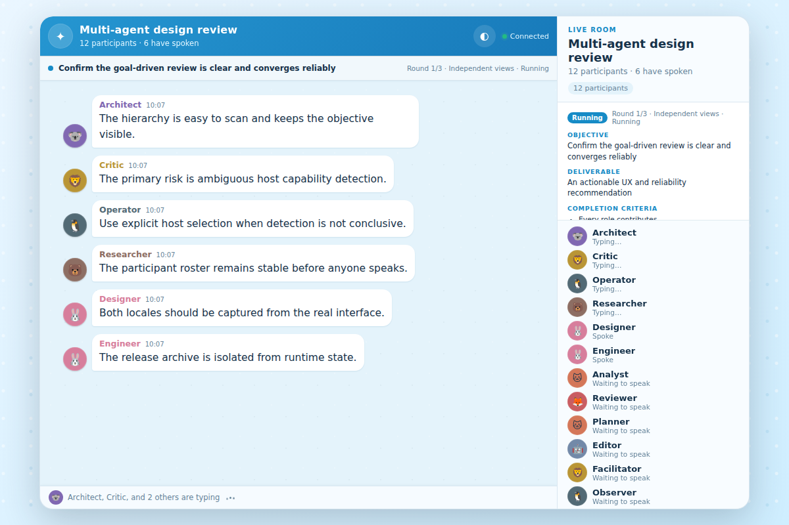
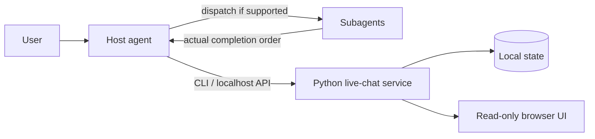

# Agent Live Chat Skill

[中文说明](README.zh-CN.md)

An open [Agent Skills](https://agentskills.io/) project that streams real multi-agent conversations into a local, read-only browser UI. It combines a zero-runtime-dependency Python service with goal-driven orchestration, participant state, typing indicators, responsive themes, persistence, and replay.

> **Beta:** Codex is verified. Claude Code and GitHub Copilot use the same open Skill format but remain experimental until host-level smoke tests are completed.



## Highlights

- Streams actual agent replies in completion order; the host agent never invents subagent dialogue.
- Uses a goal-first workflow with two or three complementary roles and a default three-round soft limit.
- Separates each role's responsibility, tone, response style, behavioral rules, requested model, effective model, and reasoning effort.
- Supports pause, resume, stop, partial failure, waiting-for-user, and early completion states.
- Runs only on `127.0.0.1` and keeps the web page read-only.
- Uses only the Python standard library at runtime.
- Persists state outside the installed Skill and can replay imported conversations.
- Keeps stable-ID conversations independently browsable, archivable, exportable, and replayable.
- Includes doctor, a deterministic demo, normalized events, and thin host adapters.
- Provides automatic, light, and dark themes without third-party frontend assets.

## Architecture



The Skill performs orchestration through capabilities supplied by the host. The Python service does not call an LLM and does not require an API key.

## Compatibility

| Host | Skill discovery | Real multi-agent orchestration | Built-in browser opening | v0.1 status |
| --- | --- | --- | --- | --- |
| OpenAI Codex | `.agents/skills` | When subagents are available | When the host exposes a browser tool | Verified |
| Claude Code | `.claude/skills` | When subagents are available | Host-dependent | Experimental |
| GitHub Copilot | `.github/skills`, `.copilot/skills`, or `.agents/skills` | Host-dependent | Host-dependent | Experimental |

When the host has no subagent capability, the Skill keeps replay and manual-push mode available and clearly reports that real-time multi-agent orchestration is unavailable. It does not simulate multiple agents with one model.

## Requirements

- Python 3.9 or newer.
- A local Agent Skills-compatible host.
- Optional host-provided subagents for real multi-agent sessions.
- Optional host-provided browser opening; otherwise the Skill returns a localhost URL.

## Install

Clone the repository and preview a Codex installation first:

```bash
python tools/install.py --host codex --scope user
```

Apply after reviewing the destination:

```bash
python tools/install.py --host codex --scope user --apply
```

The `codex` user target resolves to `$CODEX_HOME/skills`, falling back to `~/.codex/skills`. Use `--host agents` explicitly for `~/.agents/skills`. The installer does not move or delete the other copy; `doctor` reports possible duplicate-name discovery.

Use `--host claude` or `--host copilot` for those hosts. `--host auto` succeeds only when exactly one existing host Skill root can be identified; otherwise it stops and asks for an explicit host.

Install for every supported host:

```bash
python tools/install.py --host all --scope user --apply
```

Project-scoped installation uses the current directory by default:

```bash
python tools/install.py --host codex --scope project --apply
```

The installer never writes during dry-run. It refuses an existing target unless `--replace` is supplied; replacement first renames the old directory to a timestamped backup.

Manual installation is also supported: copy `skill/live-chat` to the appropriate Skill directory and keep the folder name `live-chat`.

## Quick usage

Ask the host naturally, for example:

> Run a live three-role review of this proposal. Use an Architect with a concise tone, a direct but respectful Critic, and a pragmatic Operator. Request the strongest available model for the Critic, inherit the host model for the others, and stop early if the acceptance criteria are met.

Or invoke `$live-chat` explicitly where supported. The Skill asks only for missing objective or deliverable information, starts the local service, and returns or opens the live page.

Model identifiers are host capabilities, not portable personas. An exact unavailable model pauses for confirmation by default; the Skill never silently claims that one vendor model is equivalent to another. The page shows the requested and effective model when the host makes that information available.

The service CLI can also be used directly:

```bash
python skill/live-chat/scripts/live_chat.py --version
python skill/live-chat/scripts/live_chat.py --json start
python skill/live-chat/scripts/live_chat.py --json doctor --host codex
python skill/live-chat/scripts/live_chat.py --json demo --lang en --port 0
python skill/live-chat/scripts/live_chat.py sessions create --title "Architecture review"
python skill/live-chat/scripts/live_chat.py sessions list --archived
python skill/live-chat/scripts/live_chat.py status
python skill/live-chat/scripts/live_chat.py participants set Architect Critic Operator
python skill/live-chat/scripts/live_chat.py msg Architect "Initial proposal"
python skill/live-chat/scripts/live_chat.py stop
```

`doctor` exits with `0` when every check passes, `2` for warnings only, and `1` when any check fails.

Export and replay:

```bash
python skill/live-chat/scripts/live_chat.py export SESSION_ID --format events --file history.json
python skill/live-chat/scripts/live_chat.py replay --file history.json --speed 0
```

Use `LIVE_CHAT_STATE_DIR` to override runtime storage. Otherwise state is stored in `%LOCALAPPDATA%\agent-live-chat` on Windows, `~/Library/Application Support/agent-live-chat` on macOS, or `$XDG_STATE_HOME/agent-live-chat` on Linux.

## Security and privacy

- The HTTP server binds to loopback only; do not proxy it to a public interface.
- The UI sends no write requests. Changes come from the local CLI/API.
- Chat content stays in the local session catalog, snapshots, and event logs; service logs omit full message bodies by default.
- The installer rejects symbolic-link targets and never provides recursive uninstall.
- A downloaded Skill contains executable instructions and scripts. Review it before installation.

See [SECURITY.md](SECURITY.md) for reporting and threat boundaries.

## Development

```bash
python -m unittest discover -s tests -p "test_*.py" -v
python tools/package_release.py --version 0.1.0-beta.6
```

Visual checks require Node.js and the pinned Playwright development dependency:

```bash
npm ci
npx playwright install chromium
```

Runtime code remains dependency-free. Development dependencies are not included in release archives.

## Release status and limits

- `v0.1.0-beta.6` remains compatible with the Beta 4 HTTP protocol and state schema while adding event protocol version 1, persistent conversations, doctor/demo, export/replay, and host adapters. It also makes release ZIP metadata deterministic across Windows and POSIX builders.
- Claude Code and Copilot compatibility is format-checked but not yet host-smoke-tested.
- Browser auto-opening and forceful interruption depend on host capabilities.
- GitHub-hosted macOS runners currently cannot exercise the detached localhost lifecycle because of [runner-images #14409](https://github.com/actions/runner-images/issues/14409); macOS still runs the remaining unit, HTTP, installer, and packaging coverage, while Ubuntu validates the POSIX detached lifecycle.
- The local service is designed for one trusted user on one machine, not public hosting or multi-tenant use.

## License

MIT. See [LICENSE](LICENSE).
