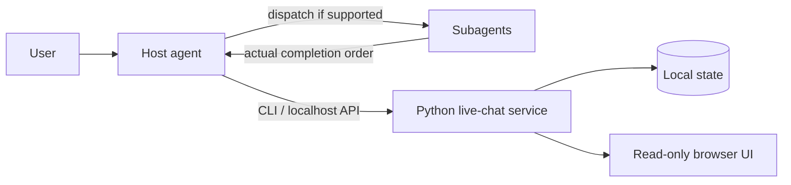

# Agent Live Chat Skill

[中文说明](README.zh-CN.md)

Watch real multi-agent work unfold in a local browser. Agent Live Chat gives an Agent Skills-compatible host a persistent, read-only conversation view with participants, typing state, goals, rounds, history, export, and replay—without calling an LLM or requiring an API key of its own.

> **Beta:** OpenAI Codex is verified. Claude Code and GitHub Copilot follow the same open Skill format but remain experimental until their host-level smoke tests are complete.


## Install in one command

Install the audited `v0.1.0-beta.6` release globally for Codex:

```bash
npx --yes skills add https://github.com/EmptyCrane/agent-live-chat-skill/releases/download/v0.1.0-beta.6/live-chat-0.1.0-beta.6.zip --global --agent codex --yes --copy
```

The command uses the open-source [`skills`](https://github.com/vercel-labs/skills) CLI. Node.js and npm are needed only for installation; the installed Skill runs on Python 3.9+ with no third-party runtime packages. `--copy` avoids symbolic-link permission requirements and places an independent copy in the CLI-managed global `~/.agents/skills/live-chat` directory. The repository installer below uses Codex's native `~/.codex/skills/live-chat` target instead.

Verify the installation:

```bash
npx --yes skills list --global --agent codex
```

Start a new Codex task, then ask:

> Use `$live-chat` to run a three-role live review of this proposal. Stop early when the acceptance criteria are met.

The pinned release is the official host-neutral package. It uses the normal service endpoint and state configuration documented below; machine-specific Codex overlays are not part of the public archive.

For experimental host installs, replace `codex` with `claude-code` or `github-copilot`. Review any third-party Skill before installing it.

## Why use it

- **Real dialogue:** displays actual subagent replies in completion order; the host never fabricates participants or messages.
- **Plan-first orchestration:** reuses known context, asks for only material gaps, and presents a bounded workflow for approval before dispatch.
- **Adaptive templates:** recommends one of ten bilingual review, diagnosis, creative, and role-play templates while keeping every proposal editable.
- **Controlled collaboration:** supports parallel panels, sequential pipelines, critic–revise loops, and debate–judge sessions with deterministic budgets.
- **Visible execution state:** shows participants, typing, decisions, per-role status, requested and effective models, progress, evidence, and terminal results.
- **Persistent conversations:** creates stable-ID sessions that can be selected, archived, restored, exported, and replayed without modifying the source.
- **Local by design:** binds only to `127.0.0.1`, keeps the browser page read-only, and stores conversation data on the local machine.
- **Small runtime:** uses only the Python standard library and ships without frontend frameworks or hosted assets.
- **Honest fallbacks:** keeps replay and manual-push workflows available when a host lacks subagents or browser opening, and reports the limitation clearly.

## How it works



The host agent owns orchestration: it understands the request, dispatches real subagents, forwards replies, and decides when the goal is complete. The bundled Python service only validates, persists, and displays the conversation.

## Host compatibility

| Host | Project Skill path | Global Skill path | Multi-agent orchestration | Status |
| --- | --- | --- | --- | --- |
| OpenAI Codex | `.agents/skills/live-chat` | `~/.agents/skills/live-chat` via the one-command installer; `~/.codex/skills/live-chat` via the repository installer | Available when the host exposes subagents | Verified |
| Claude Code | `.claude/skills/live-chat` | `~/.claude/skills/live-chat` | Available when the host exposes subagents | Experimental |
| GitHub Copilot | `.agents/skills/live-chat` or `.github/skills/live-chat` | `~/.copilot/skills/live-chat` | Depends on the Copilot surface | Experimental |

Browser opening, interruption, model selection, and reasoning controls are independent host capabilities. If a host does not expose one of them, the Skill uses the documented fallback instead of guessing.

## Use it

Natural-language example:

> Run a live three-role review of this proposal. Use an Architect with a concise tone, a direct but respectful Critic, and a pragmatic Operator. Request the strongest available model for the Critic, inherit the host model for the others, and stop early if the acceptance criteria are met.

Where supported, `$live-chat` explicitly activates the Skill. It extracts the goal, deliverable, acceptance criteria, language, constraints, roles, model policy, and budget; asks one compact batch only for material gaps; then proposes a session for approval. Say “start directly” to explicitly bypass that initial confirmation. The Skill starts or reuses the local service and opens the page through the host's browser tool or returns a localhost URL.

Model identifiers are host capabilities, not personas. If an exact requested model is unavailable, the default policy pauses for confirmation. The UI shows requested and effective models only when the host can provide that information.

### Built-in templates

The development version includes six productivity templates—architecture review, code change review, incident diagnosis, content refinement, decision debate, and idea selection—and four entertainment templates for a writers' room, worldbuilding, fictional mystery deduction, and guided adventure.

Productivity templates define a minimum, recommended roster, and template maximum. Entertainment templates define only a minimum and recommendation: larger casts run in waves according to host concurrency, with an explicit checkpoint above eight roles and a technical ceiling of 100 participants. Applying a template only persists a proposal and approval decision; it never dispatches agents.

The host recommends one fitting template with a short reason. You can select another template, edit its roles and limits, or use a blank custom plan.

### Interface language

The browser UI includes complete English and Simplified Chinese interface text. Add `?lang=en` or `?lang=zh-CN` to the page URL to choose explicitly; otherwise a Chinese browser locale selects Chinese and other locales select English. Scene titles, participant names, and chat messages are user data and are never translated automatically.

## Advanced installation

The repository installer is useful when you want a dry run, explicit scope, controlled replacement, or a timestamped backup. Clone the repository, then preview a Codex user install:

```bash
python tools/install.py --host codex --scope user
```

Apply it after reviewing the destination:

```bash
python tools/install.py --host codex --scope user --apply
```

Use `--replace` only when an existing target should be moved to a backup first. Other supported targets are `agents`, `claude`, and `copilot`; `--host auto` proceeds only when exactly one host root can be identified. Project-scoped installation uses `--scope project` and the current directory by default.

Manual installation is also supported: copy `skill/live-chat` to the appropriate Skill directory and keep the folder name `live-chat`.

## Service CLI and local data

The host normally runs these commands for you. They are also available for diagnosis and manual workflows:

```bash
python skill/live-chat/scripts/live_chat.py --version
python skill/live-chat/scripts/live_chat.py --json doctor --host codex
python skill/live-chat/scripts/live_chat.py --json start
python skill/live-chat/scripts/live_chat.py sessions create --title "Architecture review"
python skill/live-chat/scripts/live_chat.py sessions list --archived
python skill/live-chat/scripts/live_chat.py --json templates list --lang en
python skill/live-chat/scripts/live_chat.py --json templates show architecture_review --lang en
python skill/live-chat/scripts/live_chat.py --json templates apply architecture_review --lang en --stdin
python skill/live-chat/scripts/live_chat.py decision request --file decision.json
python skill/live-chat/scripts/live_chat.py decision resolve DECISION_ID approve --option-id approve
python skill/live-chat/scripts/live_chat.py export SESSION_ID --format events --file history.json
python skill/live-chat/scripts/live_chat.py replay --file history.json --speed 0
python skill/live-chat/scripts/live_chat.py stop
```

`doctor` exits with `0` when all checks pass, `2` for warnings only, and `1` when any check fails.

Default state locations:

- Windows: `%LOCALAPPDATA%\agent-live-chat`
- macOS: `~/Library/Application Support/agent-live-chat`
- Linux: `$XDG_STATE_HOME/agent-live-chat`, falling back to `~/.local/state/agent-live-chat`

Set `LIVE_CHAT_STATE_DIR` to use another location. On first use of an empty neutral state directory, the service may copy only a legacy Codex `state.json`; it never moves PID files or logs and never deletes the source.

## Security and privacy

- The HTTP server binds to loopback only. Do not expose it through a public proxy or shared port mapping.
- The web UI sends only `GET` requests; all state changes come from the local CLI/API.
- Conversation content remains in local session, snapshot, and event files. Service logs omit full message bodies by default.
- The installer rejects symbolic links and reparse points, blocks path escapes, and does not provide recursive uninstall.
- The service is designed for one trusted user on one machine, not for public hosting or multi-tenant use.

See [SECURITY.md](SECURITY.md) for the threat boundary and private reporting process.

## Development

```bash
python -m unittest discover -s tests -p "test_*.py" -v
python tools/eval_skill.py --json
python tools/package_release.py --version 0.1.0-beta.8
```

Visual checks use the pinned Playwright development dependency:

```bash
npm ci
npx playwright install chromium
```

Development dependencies, tests, state, logs, and documentation are excluded from the release ZIP.

## Beta status and limits

- The pinned installer remains the audited `v0.1.0-beta.6` release. The current development branch targets Beta 8 with the Beta 7 session/event foundation plus ten bundled templates, adaptive role policies, explicit large-cast checkpoints, and wave-based dispatch metadata while continuing to read v1 data.
- The bundled behavior evaluation is an offline policy-contract check; real host/model end-to-end acceptance remains a separate release gate.
- Claude Code and GitHub Copilot are format-checked but not yet host-smoke-tested.
- GitHub-hosted macOS runners currently skip the detached localhost lifecycle affected by [runner-images #14409](https://github.com/actions/runner-images/issues/14409); all other macOS coverage remains enabled, and Ubuntu validates the POSIX lifecycle.
- The public release is host-neutral. Host-specific browser opening, interruption, endpoint policy, and model controls depend on the active host.

## License

MIT. See [LICENSE](LICENSE).
