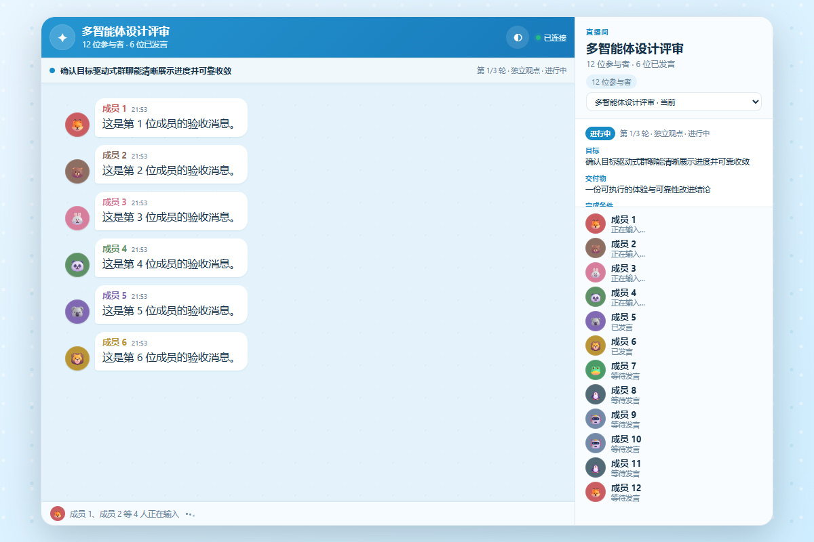
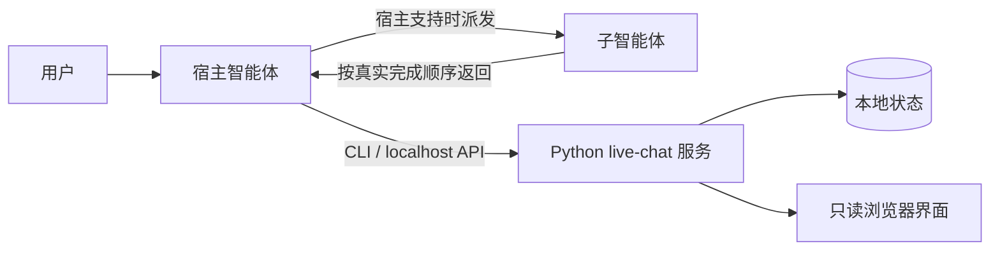

# Agent Live Chat Skill

[English README](README.md)

在本地浏览器中实时观看真正的多智能体协作。Agent Live Chat 为兼容 Agent Skills 的宿主提供只读聊天界面，完整展示参与者、输入状态、目标、轮次、历史、导出与回放；服务本身不调用 LLM，也不需要 API Key。

> **Beta 状态：** OpenAI Codex 已完成验证。Claude Code 与 GitHub Copilot 使用相同的开放 Skill 格式，但在完成对应宿主冒烟测试前仍标记为实验性。



## 一条命令安装

将已审计的 `v0.1.0-beta.6` 全局安装到 Codex：

```bash
npx --yes skills add https://github.com/EmptyCrane/agent-live-chat-skill/releases/download/v0.1.0-beta.6/live-chat-0.1.0-beta.6.zip --global --agent codex --yes --copy
```

该命令使用开源 [`skills`](https://github.com/vercel-labs/skills) CLI。Node.js 与 npm 只在安装时需要；安装后的 Skill 只要求 Python 3.9+，没有第三方运行时依赖。`--copy` 使用文件复制而非符号链接，既可避免 Windows 符号链接权限问题，也会在 CLI 管理的全局目录 `~/.agents/skills/live-chat` 中保留独立副本。下文的仓库安装器则使用 Codex 原生目标 `~/.codex/skills/live-chat`。

验证安装结果：

```bash
npx --yes skills list --global --agent codex
```

新建一个 Codex 任务，然后输入：

> 使用 `$live-chat` 对这个方案进行三角色直播评审，达到验收条件时提前结束。

此命令安装的是 GitHub 官方宿主中立版，使用下文说明的标准服务端点和状态配置；机器专用的 Codex overlay 不属于公开发布包。

如需尝试其他宿主，可将 `codex` 替换为 `claude-code` 或 `github-copilot`。安装任何第三方 Skill 前都应先审查其内容。

## 为什么使用它

- **真实对话：** 按实际完成顺序展示子智能体回复，宿主不会伪造参与者或台词。
- **先规划再执行：** 复用已有上下文，只补问关键缺口，并在派发前展示有明确边界的会话方案供用户确认。
- **自适应模板：** 从十个双语评审、会诊、创作和角色扮演模板中推荐合适起点，同时允许用户完整修改方案。
- **受控编排：** 支持并行评审、顺序流水线、批评修订和辩论仲裁，并使用确定性的轮次、角色与重试预算。
- **过程可见：** 展示参与者、输入状态、人工决策、角色运行状态、请求与实际模型、进度、证据和最终结果。
- **会话持久化：** 使用稳定 ID 保存会话，可选择、归档、恢复、导出和非破坏回放。
- **本地优先：** 只监听 `127.0.0.1`，浏览器页面只读，聊天数据保存在本机。
- **轻量运行：** 仅使用 Python 标准库，不包含前端框架或远程托管资源。
- **如实降级：** 宿主缺少子智能体或浏览器能力时，保留回放和手动推送模式，并明确说明限制。

## 工作方式



宿主智能体负责理解需求、派发真实子智能体、转发回复并判断目标是否完成。Python 服务只负责校验、持久化和展示对话，不会自行调用任何模型。

## 宿主兼容性

| 宿主 | 项目级 Skill 路径 | 全局 Skill 路径 | 多智能体编排 | 状态 |
| --- | --- | --- | --- | --- |
| OpenAI Codex | `.agents/skills/live-chat` | 一键安装使用 `~/.agents/skills/live-chat`；仓库安装器使用 `~/.codex/skills/live-chat` | 宿主暴露子智能体能力时可用 | 已验证 |
| Claude Code | `.claude/skills/live-chat` | `~/.claude/skills/live-chat` | 宿主暴露子智能体能力时可用 | 实验性 |
| GitHub Copilot | `.agents/skills/live-chat` 或 `.github/skills/live-chat` | `~/.copilot/skills/live-chat` | 取决于具体 Copilot 使用界面 | 实验性 |

打开浏览器、中断任务、选择模型和推理强度是彼此独立的宿主能力。宿主未提供某项能力时，Skill 会使用文档规定的降级路径，而不会自行猜测。

## 使用方式

自然语言示例：

> 对这个方案进行三角色直播评审：Architect 语气理性简洁，Critic 直接但尊重他人，Operator 务实；Critic 请求当前宿主最强的可用模型，其他角色继承宿主模型；达到验收条件时提前结束。

支持显式 Skill 调用的宿主可使用 `$live-chat`。Skill 会提取目标、交付物、验收条件、语言、限制、角色、模型策略和预算，只把会影响方案的缺口集中补问一次，然后提交会话方案供确认。明确说“直接开始”或“无需确认”可跳过首次确认。随后 Skill 启动或复用本地服务，并通过宿主浏览器工具打开页面；宿主没有该工具时返回 localhost 链接。

模型标识属于宿主能力，不是角色人设。精确请求的模型不可用时，默认策略会暂停并请求确认。只有宿主能够提供相关信息时，页面才会展示请求模型和实际模型。

### 内置模板

当前开发版包含六个生产力模板：架构评审、代码变更评审、故障会诊、内容润色、观点辩论和创意筛选；另有编剧室、世界观共创、虚构悬疑推理和主持式冒险四个娱乐模板。

生产力模板分别规定最少、建议和模板人数上限。娱乐模板只规定最少与建议人数：更大的阵容会依据宿主并发能力分批运行，超过八名角色必须先确认，所有会话仍受100名参与者的技术保护上限约束。套用模板只持久化方案和审批决策，不会派发智能体。

宿主会推荐一个匹配模板并简述理由。用户可以改选模板、修改角色与限制，或从空白自定义方案开始。

### 界面语言

浏览器界面提供完整英文和简体中文文案。可在页面 URL 中加入 `?lang=en` 或 `?lang=zh-CN` 显式选择；未指定时，中文浏览器环境使用中文，其他环境使用英文。场景标题、参与者名称和聊天正文属于用户数据，不会自动翻译。

## 高级安装

需要 dry-run、明确安装范围、受控替换或时间戳备份时，可使用仓库自带安装器。克隆仓库后先预览 Codex 用户级安装：

```bash
python tools/install.py --host codex --scope user
```

确认目标后执行：

```bash
python tools/install.py --host codex --scope user --apply
```

只有确定需要替换现有目录时才使用 `--replace`；安装器会先将旧目录移动到备份位置。其他可选宿主为 `agents`、`claude` 和 `copilot`；`--host auto` 仅在恰好识别出一个宿主根目录时继续。项目级安装使用 `--scope project`，默认目标为当前目录。

也可以手动复制 `skill/live-chat` 到对应的 Skill 目录，并保持目录名为 `live-chat`。

## 服务 CLI 与本地数据

通常由宿主自动调用以下命令；诊断和手动工作流也可以直接使用：

```bash
python skill/live-chat/scripts/live_chat.py --version
python skill/live-chat/scripts/live_chat.py --json doctor --host codex
python skill/live-chat/scripts/live_chat.py --json start
python skill/live-chat/scripts/live_chat.py sessions create --title "架构评审"
python skill/live-chat/scripts/live_chat.py sessions list --archived
python skill/live-chat/scripts/live_chat.py --json templates list --lang zh-CN
python skill/live-chat/scripts/live_chat.py --json templates show architecture_review --lang zh-CN
python skill/live-chat/scripts/live_chat.py --json templates apply architecture_review --lang zh-CN --stdin
python skill/live-chat/scripts/live_chat.py decision request --file decision.json
python skill/live-chat/scripts/live_chat.py decision resolve DECISION_ID approve --option-id approve
python skill/live-chat/scripts/live_chat.py export SESSION_ID --format events --file history.json
python skill/live-chat/scripts/live_chat.py replay --file history.json --speed 0
python skill/live-chat/scripts/live_chat.py stop
```

`doctor` 全部通过时退出码为 `0`，仅有警告时为 `2`，存在失败项时为 `1`。

默认状态目录：

- Windows：`%LOCALAPPDATA%\agent-live-chat`
- macOS：`~/Library/Application Support/agent-live-chat`
- Linux：`$XDG_STATE_HOME/agent-live-chat`，未设置时回退到 `~/.local/state/agent-live-chat`

可通过 `LIVE_CHAT_STATE_DIR` 指定其他位置。首次使用空的中性状态目录时，服务可能只复制旧 Codex 目录中的 `state.json`；不会迁移 PID 文件或日志，也不会删除原文件。

## 安全与隐私

- HTTP 服务只绑定回环地址，不应通过公网代理或共享端口映射对外暴露。
- Web 页面只发送 `GET` 请求；所有状态修改来自本地 CLI/API。
- 对话内容仅保存在本机会话、快照和事件文件中；服务日志默认不记录完整正文。
- 安装器拒绝符号链接和 reparse point，阻止路径逃逸，也不提供递归卸载功能。
- 服务面向单机可信用户，不适合公网托管或多租户场景。

威胁边界和私密漏洞报告方式见 [SECURITY.md](SECURITY.md)。

## 开发

```bash
python -m unittest discover -s tests -p "test_*.py" -v
python tools/eval_skill.py --json
python tools/package_release.py --version 0.1.0-beta.8
```

视觉检查使用锁定版本的 Playwright 开发依赖：

```bash
npm ci
npx playwright install chromium
```

发布 ZIP 不包含开发依赖、测试、状态、日志或说明文档。

## Beta 状态与限制

- 一键安装仍锁定已审计的 `v0.1.0-beta.6` 正式包。当前开发分支面向 Beta 8：在 Beta 7 会话与事件基础上增加十个内置模板、自适应角色策略、大型阵容显式确认和分批派发元数据，同时继续读取 v1 数据。
- 内置行为评测属于离线策略契约检查；真实宿主与模型的端到端验收仍是独立发布门禁。
- Claude Code 与 GitHub Copilot 已通过格式检查，但尚未完成对应宿主的真实冒烟测试。
- GitHub 托管的 macOS runner 目前会跳过受 [runner-images #14409](https://github.com/actions/runner-images/issues/14409) 影响的分离进程 localhost 生命周期；其余 macOS 测试仍会运行，POSIX 生命周期由 Ubuntu 验证。
- 公开发布包保持宿主中立；浏览器打开、中断、端点策略和模型控制等宿主专属行为取决于当前宿主。

## 许可证

MIT，见 [LICENSE](LICENSE)。
